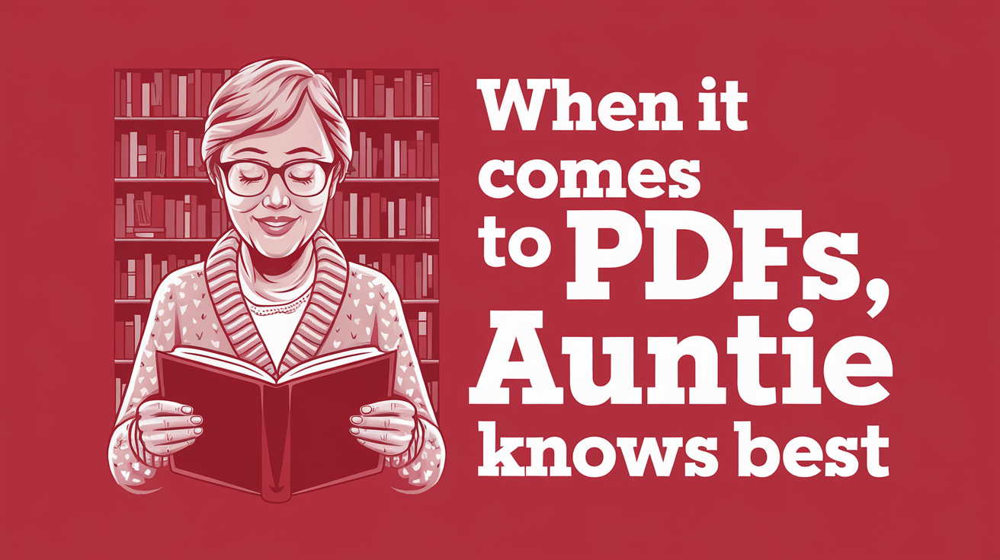

# Auntie PDF - Your Sassy PDF Guru



Your all-knowing guide that unpacks every PDF into clear, actionable insights.

## About

Auntie PDF is a web application that helps users extract information and insights from PDF documents. With a sassy, helpful personality, Auntie PDF makes understanding complex documents easier and more engaging.

## Features

- **PDF Parsing**: Upload and analyze PDF documents of any size
- **Chat Interface**: Ask questions about your documents and get instant answers
- **Intelligent Insights**: Get actionable information and summaries from your PDFs

## Technology

Auntie PDF leverages advanced AI technologies including:

- **Mistral OCR**: We use [Mistral OCR](https://mistral.ai/en/news/mistral-ocr) for powerful PDF parsing capabilities. This technology enables our application to accurately extract text and structure from PDFs, even from complex layouts and formats.
- **Next.js**: Built with the React framework for production-grade applications
- **AI-powered chat**: Interact naturally with your documents through conversational AI

## Getting Started

First, run the development server:

```bash
npm run dev
# or
yarn dev
# or
pnpm dev
# or
bun dev
```

Open [http://localhost:3000](http://localhost:3000) with your browser to see the result.

## Learn More

To learn more about the technologies used in this project:

- [Next.js Documentation](https://nextjs.org/docs)
- [Mistral OCR](https://mistral.ai/en/news/mistral-ocr) - Learn about the OCR technology powering our PDF parsing

## Connect

Follow the creator: [@deepwhitman](https://x.com/deepwhitman)
